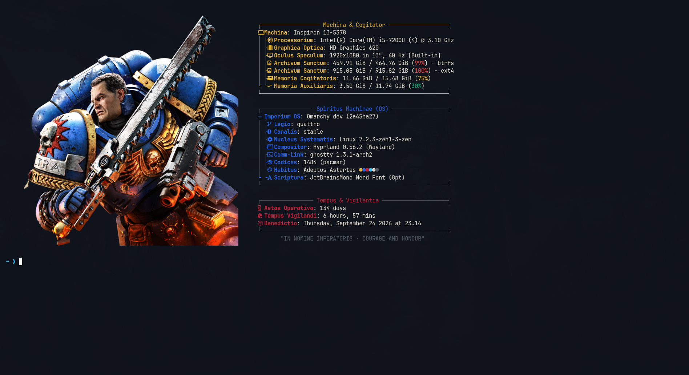
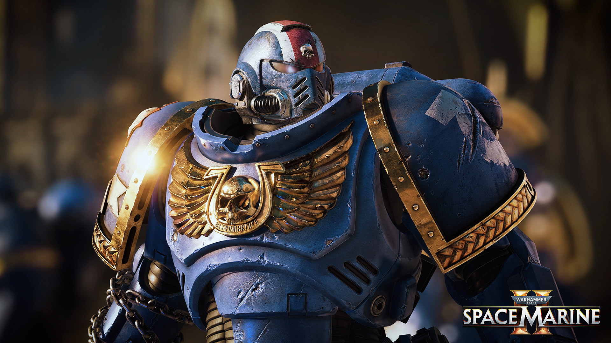
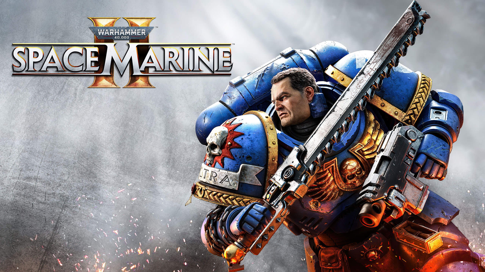
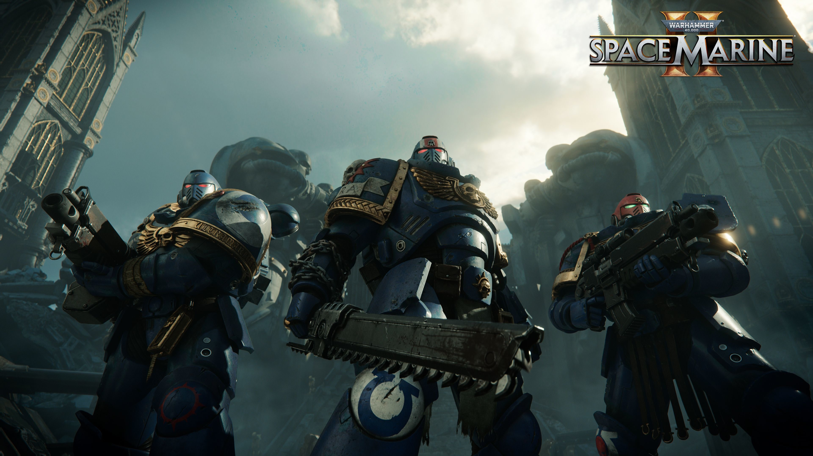
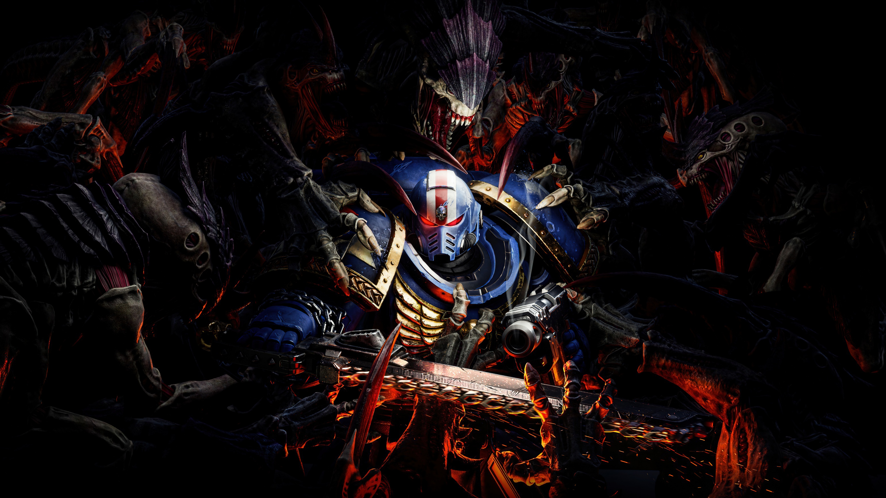
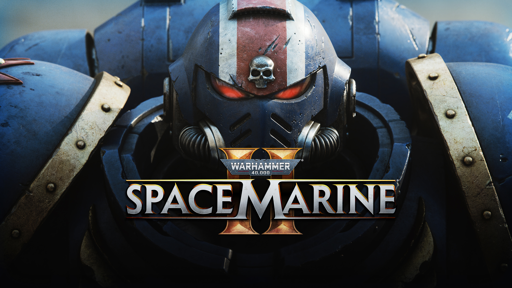
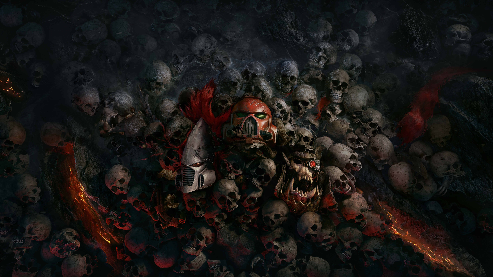
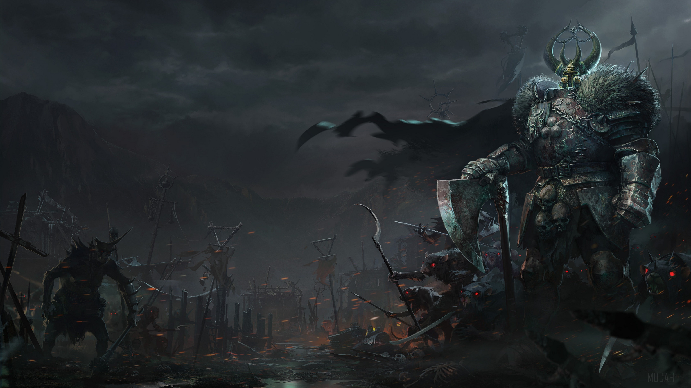
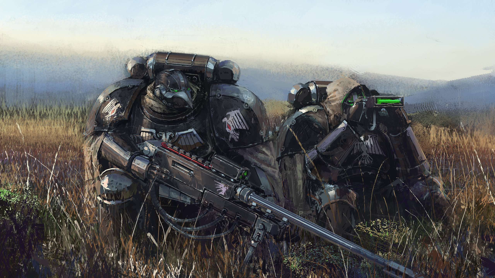
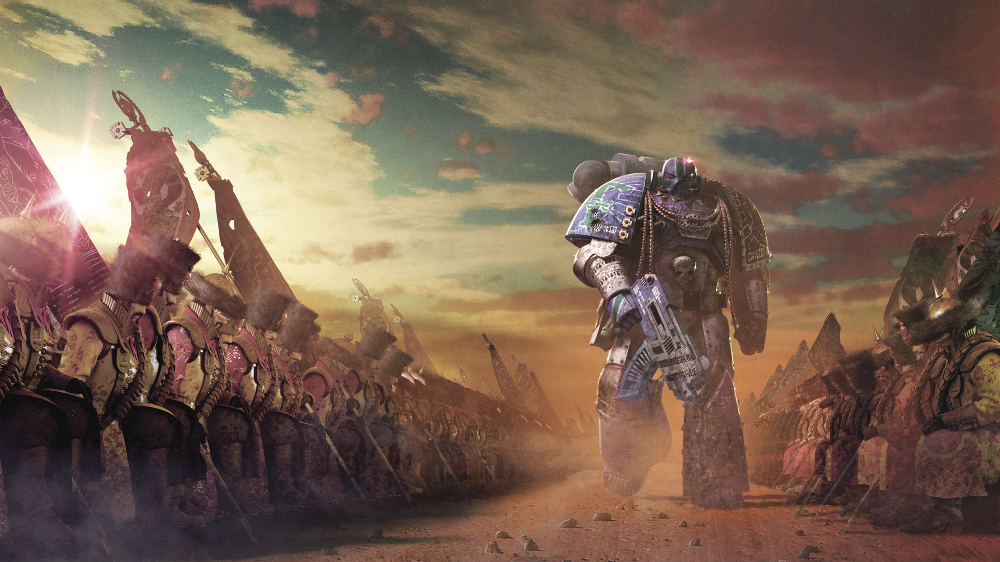

# Warhammer 40,000: Space Marine · Omarchy Theme

> *"They shall be my finest warriors, these men who give of themselves to me. Like clay I shall mould them, and in the furnace of war forge them."*  
> — **The God-Emperor of Mankind**

An authentic, modern grimdark theme for [Omarchy](https://omarchy.org) Quattro. Centered around **Captain Demetrian Titus**, the **Ultramarines**, and the **Adeptus Astartes**, it pairs deep **Void Hull Black** canvases with the regal brilliance of **Imperial Auric Gold**, battle-forged **Macragge Blue**, **Purity Seal Crimson**, and **Vellum Parchment** typography.

---

## Previews


---

## Install & Apply

Install directly into Omarchy with a single command:

```bash
omarchy theme install https://github.com/anmolsharma152/omarchy-space-marine-theme
omarchy theme set space-marine
```

Or open the graphical Omarchy theme picker with `Super + Alt + Space` (Style > Theme).

---

## Features

- **Pure Omarchy Quattro Architecture:** Built natively with `colors.toml` and `shell.toml` for the unified `omarchy-shell`. Zero legacy bloat, zero deprecated daemons.
- **High Gothic Fastfetch Cogitator:** Custom Fastfetch layout featuring Latin cogitator terminology, system diagnostic telemetry, and color badges.
- **Dynamic Asset Cycler:** Rotates through all image logos in `fastfetch-logos/` automatically on each `fastfetch` call without distortion or horizontal stretching.
- **Manual Asset Pinning:** Pin any logo from `fastfetch-logos/` on demand using `./set-logo.sh <1-N>`.
- **Luminous Window Geometry:** Dynamic polished **Imperial Auric Gold** into **Macragge Blue** gradient active window borders (`rgb(FBBF24) rgb(D97706) rgb(2563EB) rgb(1E3A8A) 45deg`) for unmistakable active window focus across dark and light backgrounds.
- **Cinematic Wallpapers:** Curated collection of high-resolution 4K/QHD wallpapers featuring Captain Titus, combat drops, hive cities, and gothic cathedrals.
- **Full Disk Encryption & Lock Signet:** Bundled with the Imperial Aquila as `unlock.png` for Plymouth full disk encryption boot splash and lock screen authentication.
- **Universal Application Inheritance:** Terminals (Ghostty, Foot, Kitty, Alacritty), text editors (Neovim, Zed, Helix, VS Code), and system monitors (btop) automatically inherit the theme palette.

---

## Palette Overview

| Role | Color Name | Hex Code | Purpose |
| :--- | :--- | :--- | :--- |
| **Canvas** | *Void Hull Black* | `#0E121B` | Deep-space grimdark canvas with gothic blue undertone |
| **Surface** | *Cathedral Slate* | `#151B27` | Popups, menus, launcher cards, and terminal surfaces |
| **Accent Primary** | *Imperial Auric Gold* | `#FBBF24` / `#E5B53B` | Active window borders, titles, badges, and focus rings |
| **Accent Secondary**| *Macragge Blue* | `#2563EB` | Active tabs, selections, and Space Marine heraldry |
| **Warning / Error** | *Purity Seal Crimson* | `#C41E3A` | Errors, warnings, high CPU/RAM alerts, and polkit states |
| **Typography** | *Vellum Parchment* | `#E2DFD2` | High-contrast, clean imperial scroll text |
| **Muted** | *Ceramite Grey* | `#4B5563` | Inactive window frames and dividers |
| **Energy** | *Plasma Cyan* | `#38BDF8` | Power fields, active telemetry, and sensor links |

---

## High Gothic Fastfetch Cogitator



Fastfetch is styled as an Imperial **Cogitator Sanctus**:

```text
┌────────────────── Machina & Cogitator ──────────────────┐
 Machina: Host Machine
│ ├ Processorium: CPU Cores & Frequency
│ ├ Graphica Optica: GPU
│ ├󱄄 Oculus Speculum: Display Resolution & Refresh
│ ├󰋊 Archivum Sanctum: Disk Storage
│ ├ Memoria Cogitatoris: RAM Usage
└ └󰓡 Memoria Auxiliaris: Swap
└─────────────────────────────────────────────────────────┘

┌──────────────── Spiritus Machinae (OS) ─────────────────┐
 Imperium OS: Omarchy Quattro
│ ├󰘬 Legio: Branch
│ ├ Nucleus Systematis: Linux Kernel
│ ├ Compositor: Hyprland
│ ├ Comm-Link: Active Terminal
│ ├󰏖 Codices: Installed Packages
│ ├󰸌 Habitus: Space Marine · Adeptus Astartes
└─────────────────────────────────────────────────────────┘

┌──────────────── Tempus & Vigilantia ────────────────────┐
󱦟 Aetas Operativa: Operating Age (Days)
󱫐 Tempus Vigilandi: System Uptime
 Benedictio: Last Package Update Time
└─────────────────────────────────────────────────────────┘
       "IN NOMINE IMPERATORIS · COURAGE AND HONOUR"
```

### Rotating Logo Assets (`fastfetch-logos/`)

The cogitator dynamically discovers all images in `fastfetch-logos/` and cycles through them sequentially on each invocation:

- **Automatic Cycle:** Cycles automatically every time `fastfetch` runs in your terminal.
- **Manual Pinning:** Run `./set-logo.sh` to see all available logos and pin any one by index (e.g. `./set-logo.sh 1`).
- **Dynamic Extensibility:** Drop any `.png` or `.jpg` into `fastfetch-logos/`—it will be automatically discovered and scaled with zero distortion.

---

## Wallpapers Included (`backgrounds/`)

Cycle through the wallpaper gallery at any time with `Super + Ctrl + Space` or:
```bash
omarchy theme bg next
```

### Featured Gallery

| **00 · Righteous Stand** | **01 · Cinematic Close-Up** | **03 · Ultramarine Squad** |
| :---: | :---: | :---: |
|  |  |  |
| **04 · Void Assault** | **05 · Cathedral Battle** | **13 · Battle Barge Broadside** |
|  |  |  |
| **14 · Black Templar Zealot** | **15 · Astartes Banner Glory** | **16 · Space Marine Duel** |
|  |  |  |

<details>
<summary><b>View all 22+ included wallpapers</b></summary>
<br>

- `00-titus-righteous-stand.jpg`
- `01-titus-close-up-cinematic.jpg`
- `02-titus-fight-swarm-4k.jpg`
- `03-space-marine-squad-4k.jpg`
- `04-void-assault-4k.jpg`
- `05-cathedral-battle-4k.jpg`
- `06-space-marine-wrath-4k.jpg`
- `07-astartes-battlefield.jpg`
- `08-titus-portrait-glare.jpg`
- `09-titus-combat-stance.png`
- `10-secret-level-astartes-lineup.jpg`
- `11-gothic-cathedral-void-4k.jpg`
- `12-astartes-terminator-assault-4k.jpg`
- `13-battle-barge-broadside-8k.jpg`
- `14-black-templar-zealot-4k.jpg`
- `15-astartes-banner-glory-qhd.jpg`
- `16-space-marine-duel-qhd.jpg`
- `17-titus-cinematic-ruins.jpg`
- `18-sm2-hive-city-overlook.jpg`
- `19-sm2-swarms-incoming.jpg`
- `20-sm2-demetrian-titus-advance.jpg`
- `21-sm2-orbital-descent.jpg`

Add your own custom wallpapers anytime by dropping images directly into `backgrounds/`—Omarchy discovers and fits them automatically.
</details>

---

## Attribution & Lore

- **Warhammer 40,000** and all associated marks, logos, names, and characters are copyright © [Games Workshop Limited](https://www.games-workshop.com/).
- **Warhammer 40,000: Space Marine 2** is developed by [Saber Interactive](https://saber.games/) and published by [Focus Entertainment](https://www.focus-entmt.com/).
- Built for the [Omarchy](https://omarchy.org/) Linux distribution.
