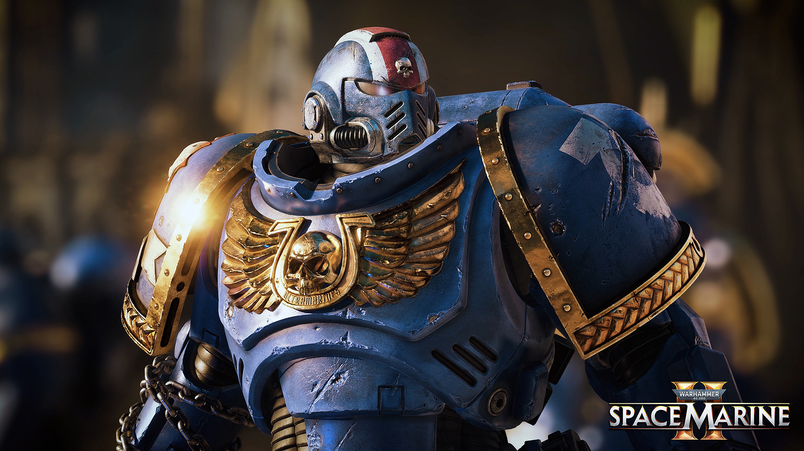
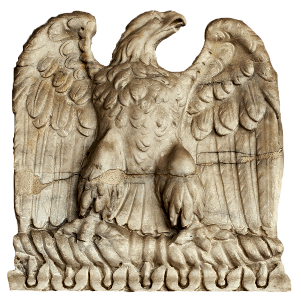

# Omarchy Adeptus Astartes Theme

> *"They shall be my finest warriors, these men who give of themselves to me. Like clay I shall mould them, and in the furnace of war forge them."*  
> — **The God-Emperor of Mankind**

**Adeptus Astartes** brings the grim darkness of the Warhammer 40,000 universe into a clean, graphic, modern desktop for [Omarchy](https://omarchy.org) Quattro. Centered around **Captain Demetrian Titus** and the **Ultramarines**, it pairs deep **Void Black** canvases with the regal brilliance of **Imperial Auric Gold**, battle-forged **Macragge Blue**, **Purity Seal Crimson**, and **Vellum Parchment** typography.

---

## Previews





---

## Features

- **Semantic Quattro Palette:** Built natively for Omarchy Quattro via `colors.toml` and `shell.toml`.
- **High Gothic Fastfetch Cogitator:** Fully customized Fastfetch presentation with Latin terminology, color badges, and embedded Space Marine chapter heraldry.
- **Graphic Window Geometry:** Active dual-tone Auric Gold and Macragge Blue borders (`rgb(E5B53B)` to `rgb(2563EB)`) with clean drop shadows.
- **Cinematic 4K/QHD Wallpapers:** Curated collection of Captain Titus character close-ups, swarm fight scenes, cathedral battles, and void fleet assaults.
- **Full Application Inheritance:** Terminals (Ghostty, Kitty, Foot, Alacritty), text editors (Neovim, Zed, Helix, VS Code), and system monitors (btop) automatically inherit the palette.
- **Full Compatibility:** Includes fallback definitions for SwayOSD, Mako, Walker, Waybar, and Hyprlock.

---

## Palette Overview

| Role | Color Name | Hex Code | Purpose |
| :--- | :--- | :--- | :--- |
| **Canvas** | *Void Hull Black* | `#0E121B` | Deep-space grimdark canvas with gothic blue undertone |
| **Surface** | *Cathedral Slate* | `#151B27` | Popups, menus, launcher cards, and terminal surfaces |
| **Accent Primary** | *Imperial Auric Gold* | `#E5B53B` | Active window borders, titles, badges, and focus rings |
| **Accent Secondary**| *Macragge Blue* | `#2563EB` | Active tabs, selections, and Space Marine heraldry |
| **Warning / Error** | *Purity Seal Crimson* | `#C41E3A` | Errors, warnings, high CPU/RAM alerts, and polkit states |
| **Typography** | *Vellum Parchment* | `#E2DFD2` | High-contrast, clean imperial scroll text |
| **Muted** | *Ceramite Grey* | `#4B5563` | Inactive window frames and dividers |
| **Energy** | *Plasma Cyan* | `#38BDF8` | Power fields, active telemetry, and sensor links |

---

## Fastfetch Cogitator (High Gothic Telemetry)

Fastfetch is configured to emulate an imperial **Cogitator Sanctus**:

```text
┌────────────────── Machina & Cogitator ──────────────────┐
 Machina: Host Machine
│ ├ Processorium: CPU Cores & Frequency
│ ├ Graphica Optica: GPU
│ ├󱄄 Oculus Speculum: Display Resolution & Refresh
│ ├󰋊 Archivum Sanctum: Disk Storage
│ ├ Memoria Cogitatoris: RAM Usage
└ └󰓡 Memoria Auxiliaris: Swap
└─────────────────────────────────────────────────────────┘

┌──────────────── Spiritus Machinae (OS) ─────────────────┐
 Imperium OS: Omarchy Quattro
│ ├󰘬 Legio: Branch
│ ├ Nucleus Systematis: Linux Kernel
│ ├ Compositor: Hyprland
│ ├ Comm-Link: Active Terminal
│ ├󰏖 Codices: Installed Packages
│ ├󰸌 Habitus: Adeptus Astartes
└─────────────────────────────────────────────────────────┘

┌──────────────── Tempus & Vigilantia ────────────────────┐
󱦟 Aetas Operativa: Operating Age (Days)
󱫐 Tempus Vigilandi: System Uptime
 Benedictio: Last Package Update Time
└─────────────────────────────────────────────────────────┘
       "IN NOMINE IMPERATORIS · COURAGE AND HONOUR"
```

---

## Wallpapers Included (`backgrounds/`)

Cycle through the wallpapers at any time with `Super + Ctrl + Space`:
- `00-titus-righteous-stand.jpg` — Captain Titus holding ground in rain and ash.
- `01-titus-close-up-cinematic.jpg` — High-intensity cinematic close-up of Titus.
- `02-titus-fight-swarm-4k.jpg` — Titus cutting through Tyranid swarms with chainsword and bolt rifle (4K).
- `03-space-marine-squad-4k.jpg` — Astartes squad marching through fire and ruins (4K).
- `04-void-assault-4k.jpg` — Battle fleet in orbit during an orbital drop operation (4K).
- `05-cathedral-battle-4k.jpg` — Colossal gothic cathedral combat scene (4K).
- `06-space-marine-wrath-4k.jpg` — Power armor melee engagement (4K).
- `07-astartes-battlefield.jpg` — Panoramic battlefield view.

---

## Installation & Switching

To switch to this theme at any time:
```bash
omarchy theme set astartes
```

Or open the Omarchy theme picker:
```bash
omarchy-theme-switcher
```

---

## Attribution & Lore

- *Warhammer 40,000*, *Space Marine*, *Captain Demetrian Titus*, and the *Ultramarines* are intellectual property of **Games Workshop Ltd.**
- Concept art and character promotional renders credit to **Focus Entertainment** and **Saber Interactive**.
